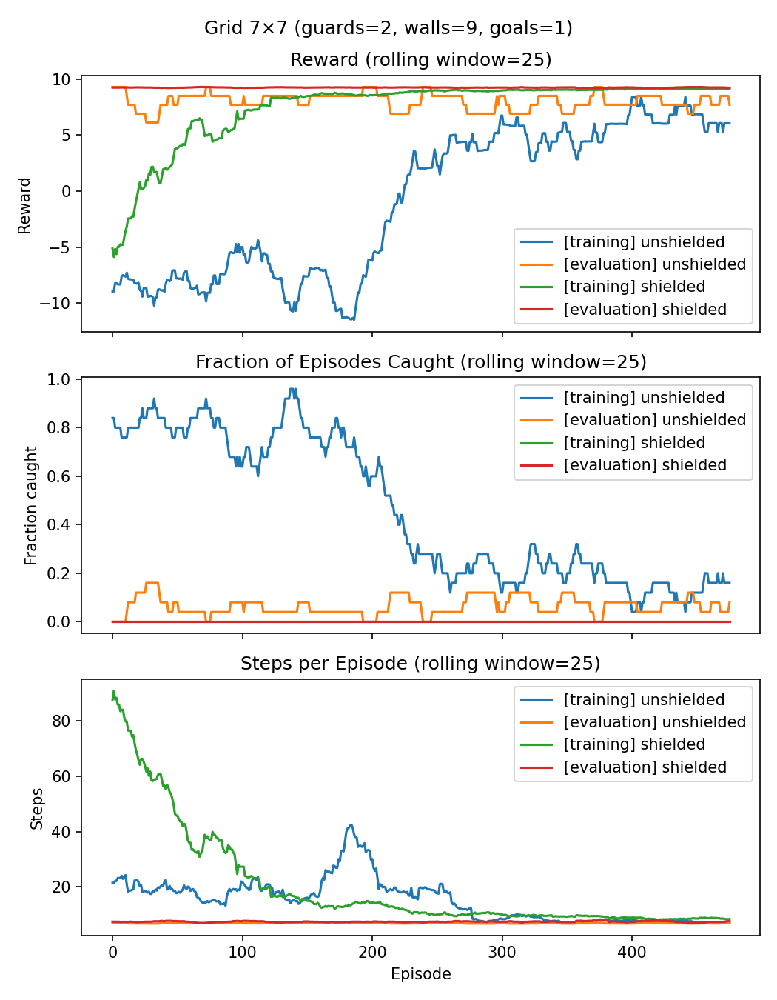
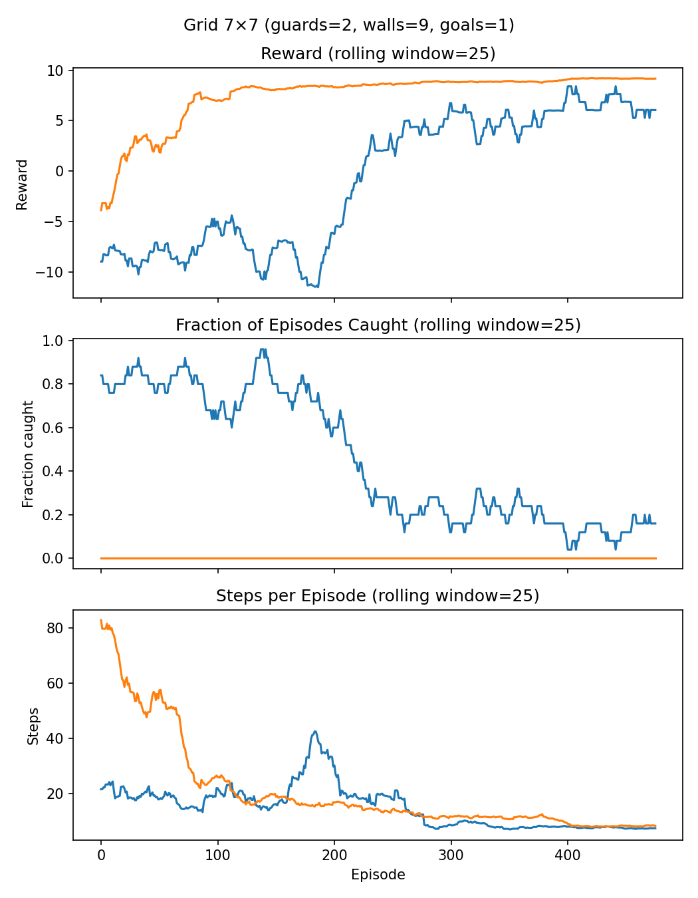

# Safe RL Gridworld — Shielding as in _Safe Reinforcement Learning via Shielding_

This project is a small, self-contained implementation of **shielded reinforcement learning** in a gridworld, inspired by the paper:

> M. Alshiekh, R. Bloem, R. Ehlers, B. Könighofer, S. Niekum, and U. Topcu, “Safe Reinforcement Learning via Shielding”, _AAAI_, vol. 32, no. 1, Apr. 2018.

It implements a safety-aware reinforcement learning environment based on a dynamic gridworld with moving guards, demonstrating how to:

- Encode a safety property as a **DFA** over state labels.
- Solve a **safety game** to compute the winning (safe) region.
- Build a **runtime safety shield** that filters RL actions to enforce safety.
- Compare **unshielded vs. shielded** Q-learning on the same grid configuration.

The core safety property requires the agent to avoid walls and to avoid being caught by guards. When the shield is enabled, unsafe episodes are eliminated for all realizable configurations.

Guards have a simple, limited field of view: they can only see in the direction they are facing and they randomly choose a new facing direction at each step. An agent is considered caught if it moves into a guard or if it enters the guard's field of view.

---

# 1 Gridworld Overview

The gridworld is a 2D grid with:

- **Empty cells**
- **Walls** (`#`)  
  The agent cannot move onto them.
- **Goals** (`G`)  
  Reaching a goal yields a positive reward.
- **Guards** (`^ v < >`)  
  Guards occupy a cell, face a direction and move stochastically.
- **Start position** (`S`)  
  The initial position of the agent.

---

## 1.1 Agent Dynamics

The agent:

- Occupies **exactly one grid cell**
- Has **five actions** (`UP, DOWN, LEFT, RIGHT, STAY`)
- Cannot move into:
  - wall cells
  - cells outside the grid boundaries
  - cells currently occupied by guards

---

## 1.2 Guard Dynamics

Guards are autonomous adversaries:

- Each guard has:
  - a **position** `(row, col)`
  - a **facing direction** (`UP, DOWN, LEFT, RIGHT`)
- They move **stochastically** every time step, following rules:
  1. They can move 1 cell in any direction **if**:
     - within bounds
     - not a wall
     - not the agent's new position
     - not another guard's position
  2. Immediate **backtracking** (turning around 180°) is discouraged unless it is the only valid option.
  3. If no valid move exists, the guard **stays in place**.
- Guards may take different combinations of possible moves; the shield uses the **set of all nondeterministic outcomes** to assess worst-case safety.

### Guard Vision

A guard **catches** the agent if:

- They stand on the same tile, or
- The agent is in straight-line sight up to `VISION_RANGE` tiles in the guard's facing direction, **unblocked by walls**.

If caught, the episode ends (if `terminate_if_caught= True`).

---

# 2 Safety Shield

- The **Safety Game Solver** computes all reachable product states (MDP state × DFA state) and determines the winning region: the set of states from which the agent can remain safe indefinitely under some strategy.
- The **Safety Shield** ensures that the agent’s chosen action never leaves the winning region.

If the initial MDP state is not in the winning region, the configuration is **unrealizable**, and training is aborted.

---

# 3 Running the Project

```
python -m venv .venv
source .venv/bin/activate
pip install -e .

# Run run_train.sh to execute train.py
run_train.sh
```

---

# 4 Experiments

---

The evaluation phase is run _after_ all training episodes and uses the same number of episodes as training. In evaluation, the shielded agent consistently achieves a high average reward, reflecting that the shield successfully prevents it from entering unsafe states (e.g., being seen or caught by guards). In contrast, the unshielded agent shows fluctuating rewards, as it cannot reliably avoid the guards and occasionally moves into unsafe regions.

This difference is also clearly visible in the caught fraction: for the shielded agent, the fraction of episodes in which it is caught remains at zero, while the unshielded agent maintains a fluctuating caught fraction throughout evaluation.

`S` = start, `G` = guard, `#` = wall, `^ v < >` = guard facing directions, `.` = empty cell.

---

## 4.1 Shielded vs Unshielded on a 7×7 Gridworld (`seed = 0`)

---

```
.  .  G  .  #  ^  .
.  .  .  .  #  .  #
.  .  .  #  #  .  .
.  .  .  #  .  .  .
.  .  .  .  .  #  .
.  .  .  .  .  .  .
.  .  .  S  #  <  #
```



---

## 4.1 Shielded vs Unshielded on a 7×7 Gridworld (`seed = 42`)

---
```
.  .  .  .  .  G  # 
.  #  .  .  .  #  . 
.  v  .  .  .  .  . 
.  .  .  .  .  .  . 
.  .  #  #  #  .  . 
S  .  .  <  .  #  . 
.  #  .  .  .  .  #
```


